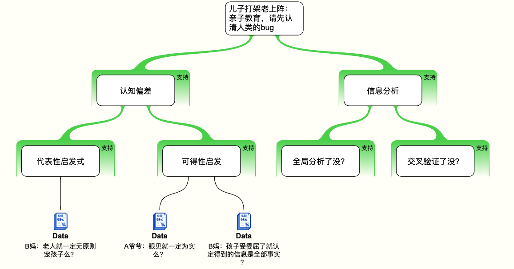
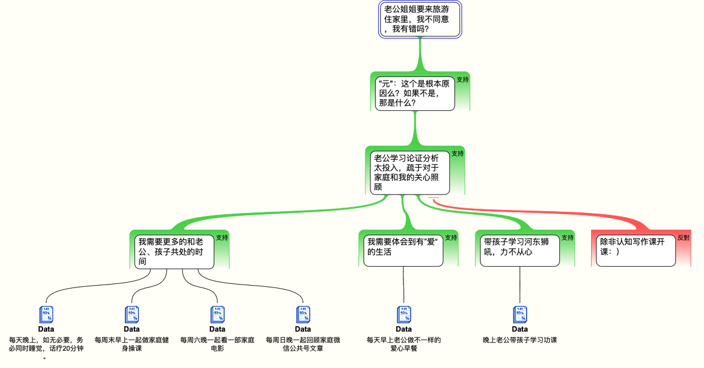

## 主题
亮灯模式——识别你的人生bug

## 摘要
1. 谁的舞台：儿子打架老上阵，亲子教育，请先认清人类的bug
2. 合作而不是对抗：家不是讲理的地方

## 人时地

召集人：Even 陈晨

参与人:  论证分析二期

分享人：皓同学

会议时间: 190630 19:42 UTC+8

会议地点: Zoom

## 正文

### 谁的舞台：儿子打架老上阵，亲子教育，请先认清人类的bug

#### 故事概要：

ABC三个小朋友在本地的一个社群Scout一起参加活动的过程中，A和B发生了点小矛盾，产生了肢体冲突，随后家长们在群里讨论的场景。其中ABC三个小朋友都在同一所学校同一年级，B和C是同班同学，A爸和C爸是大学同班同学，A和B家长互不相识。A和B都是由C爸介绍加入该社群。

#### 角色：

ABC小朋友，A妈，A爷爷，B妈，C爸

#### 群聊记录：

B妈：昨晚两个孩子在Scout发生了肢体冲突，A先动手打了B胸部和腹部7下，B再踢了一下踢回去，A和B这种行为都不对，都应当批评。据另一位在场的孩子George反映，A还说了“fuck”。但是然后！！！A的爷爷看B的家长不在，很凶地责备B，然后活动过程中一直盯着B，B感受到了威胁（bullying），睡前还在不断重复“那个可怕的爷爷”，作为B的妈妈，我觉得已经对孩子产生心理阴影，因此将这个信息发出来，希望不要再有类似的事情发生。我已经和Scout的leader沟通，建议再次在孩子面前重申Scout是一个有着很强价值观的地方，互相尊重对方和规范正确的行为。同时希望各位家长都能理性公平地对待别人的孩子，不要对孩子之间的冲突进行无理干涉，更不要让孩子感受到来自成人的威胁。

A妈：我是你所说的A的妈妈，我同意你所说的这种行为都应该受到批评，各家长都要理性公平的对待别人的孩子，不要对孩子之间的冲突进行无理干涉。但据我所知，并且我儿子同学家长在场也可作证，你所说的情况与我所了解的有相当冲突。A只打了B一下，是因为B与我所说在场看见事件经过的家长的孩子C一起说了一些“secret”，并且嘲笑A，所以A才会上去打了B一下，然后B一脚踢在A脚上，A爷爷看到了，就对B说，A打你是他不对，可是你也不能回踢A啊。我觉得A爷爷说的没错，A也完全没有说什么脏话，C家长当时在场，我想他应该可以作证。至于A爷爷的态度问题，如果真的有对你儿子造成影响，我很抱歉，我也严厉批评了我儿子，这件事情双方都有不对，小孩子之间本来今天打闹明天和好的事很正常，家长其实本不应该介入，需要以公正的态度来阻止这种行为。我也会提醒A爷爷他的态度问题。

C爸：我是C的爸爸，我也还原一下当时现场的事情。当时天黑，孩子们在操场上玩，我和A的爷爷在聊天儿，很多小朋友在那边来回的跑动和追逐，我们开始并没有当回事，只是当做孩子之间的普通打闹。等到我们注意到的时候，是B踢了A一下，A躺在地上哭起来。这样才引起了我们的注意，过去分别询问了A和B的情况。我先问A，A情绪比较激动，说B狠踢了他，再问B，B解释是开始说了点笑话，然后A打了B的肚子。A的爷爷说的话如上述A妈妈所说，不再复述。至于A有没有说脏话，我当时没细问B，也并不知情。

我分别跟A和B说，以后有任何冲突，首先找队长和老师，其次找身边的大人。互相不能有侮辱性的语言，更不能有肢体的暴力冲突。因为马上他们就要回到大厅参加活动，我就先让他们彼此分开，各自回到大厅。

至于之前B和C说的secret的这个细节，我也才刚刚知道，今天放学后会和孩子再确认一下具体情况。

每个孩子、包括家长都可能不能看到全部的客观事实，这需要我们家长通过密切沟通、多方了解，然后做交叉验证，这样可以基本确认事实的全部真相。然后基于共同的原则，友好协商处理。

因为Scout Keas之前只有C一个华人孩子，你们也都是我介绍进来的，我也希望咱们也都能很好的融入这个本地最有特色的社群，保持团结、自律、客观、公正。

相关极端案例：

[孩子在学校被骂？家长持刀冲进学校，捅死10岁男生_腾讯网](https://xw.qq.com/partner/vivoscreen/20190511A03VJL/20190511A03VJL00?vivoRcdMark=1)

### 合作而不是对抗：家不是讲理的地方

**直男的形式逻辑vs.暖男的非形式逻辑**

[老公姐姐要来旅游住家里，我不同意，我有错吗？ - 知乎](https://www.zhihu.com/question/49364191)

背景：老公有两个姐姐，公公去世，婆婆帮我们看六个月的宝宝。我，独生女，父母都是医生。都是十八线小城市的，老公一家是农村，我家是城里。

我们刚在旅游城市买了房安定下来，为了以后要二胎买的套三。婆婆来给看孩子，我们平时相处的很好，一些生活习惯也是彼此磨合中。这周末我父母开车来看孩子。老公突然提出他大姐要带孩子来玩儿，我说欢迎欢迎，招待费我们全出，只是不要住在家里，找酒店，我们掏钱。就因为这个，婆婆和老公都不愿意了，说我这么做是当他姐外人，再说家里也有地方住，为啥非得出去住。我觉得家里是很私密的地方，大夏天的别人来，要穿戴整齐实在是折磨，而且宝宝才六个月，家里一来生人就一整天不睡觉，更不要说还有个五六岁的小孩儿上蹿下跳皮的要命。然后因为我父母也在场，我在屋里喂奶，婆婆在外面和我父母说想不通为啥不能在家住，自己的女儿，说着说着居然哭了！！！搞得我们都超无语。题主绝对不是小气的人，亲戚来当然欢迎，必须热情招待的，就因为不让住家里，就成坏人了，现在都在冷战，搞的我父母本来要住一个周的，第二天就走了。我有错么？

"我亲爱的朋友，收拾好你的行囊，带上你的护身符，我们开始上路吧。虽然最终可能一无所获，但这正是我们所选的路，这正是我们要走的路。"

## Changelog

- 190629 V2.0 只保留故事
- 190628 V1.0 初稿，完成大纲