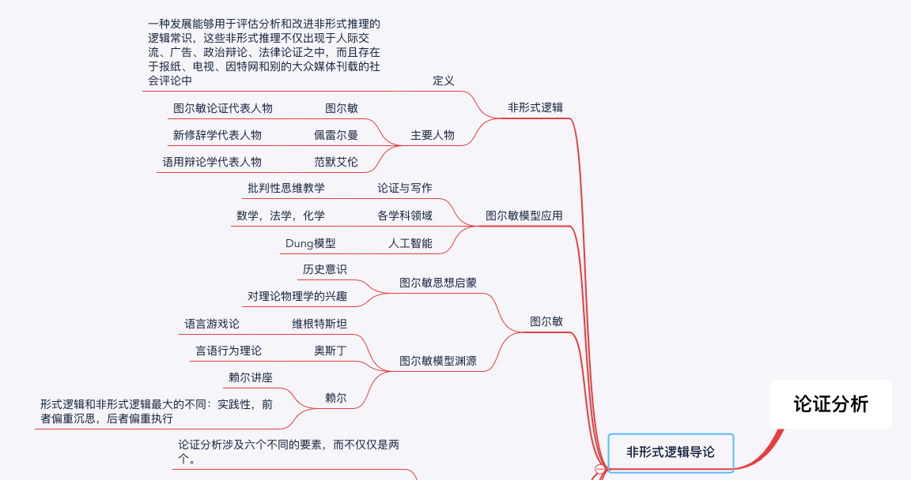
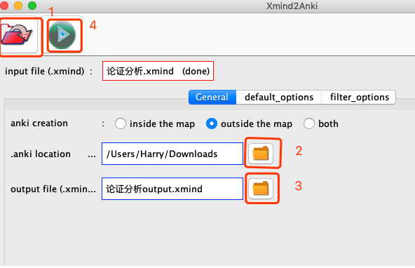
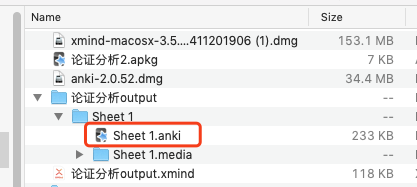
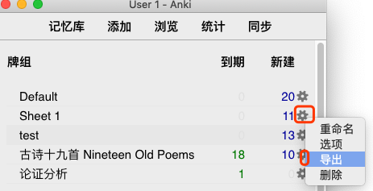
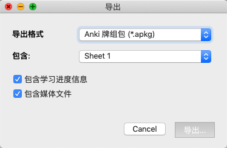
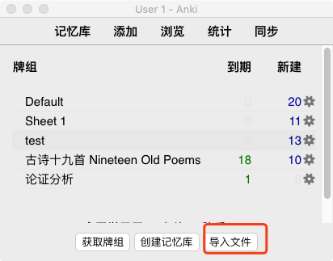
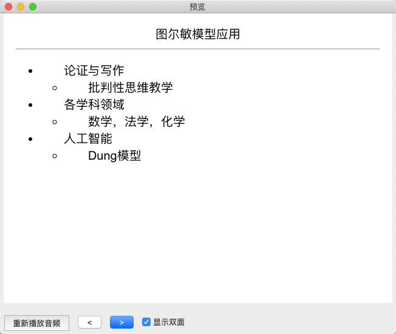
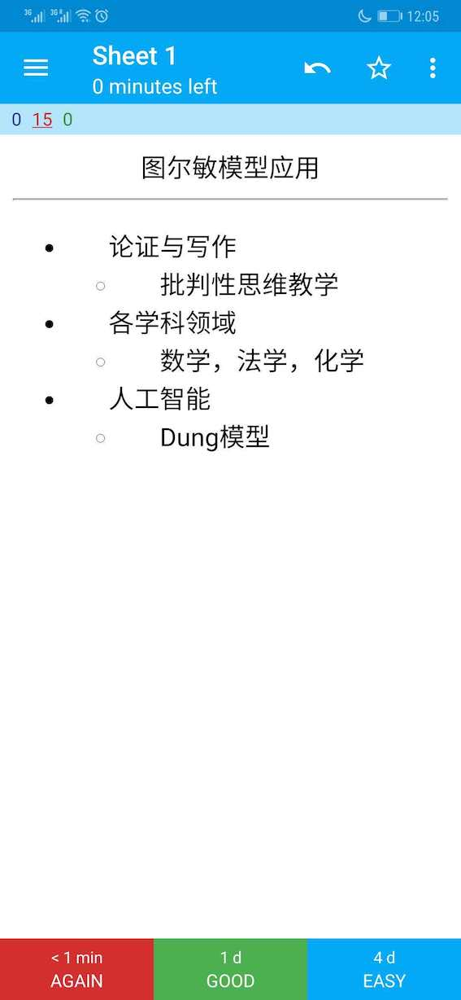

本文档用于实现从xmind的anki的闭环操作。

1. Anki

下载anki-2.0.52.dmg

[Index of /downloads/archive/](https://apps.ankiweb.net/downloads/archive/)

2. xmind

下载

 [/XMind 6/3.5.1/xmind-macosx-3.5.1.201411201906.dmg](http://sourceforge.net/projects/xmind3/files/XMind 6/3.5.1/xmind-macosx-3.5.1.201411201906.dmg/download)

[XMind download | SourceForge.net](https://sourceforge.net/projects/xmind3/)

3.  xmind2anki

[Xmind2Anki download | SourceForge.net](https://sourceforge.net/projects/xmind2anki/)

[brumar/Xmind2Anki: Ankification of xmind files](https://github.com/brumar/Xmind2Anki)

转换方法

[Xmind2Anki-utilisation](http://cognitive-projects.com/Xmind2Anki/en_utilisation.html)

4. Sample

a. xmind

b. 转换论证分析课程

c. 用老版anki打开

d. 将老的anki格式导出成apkg格式

e. 新版Anki导入

f. 即可实现同步

g. 同步云端和手机端即可

### 参考

- [印象笔记+Anki+Forest+Xmind，打造完美考试闭环_复习](http://www.sohu.com/a/313339245_212759)

- [Chinese - AnkiWeb](https://ankiweb.net/shared/decks/chinese)

### Changelog

- 20190611 V1.0